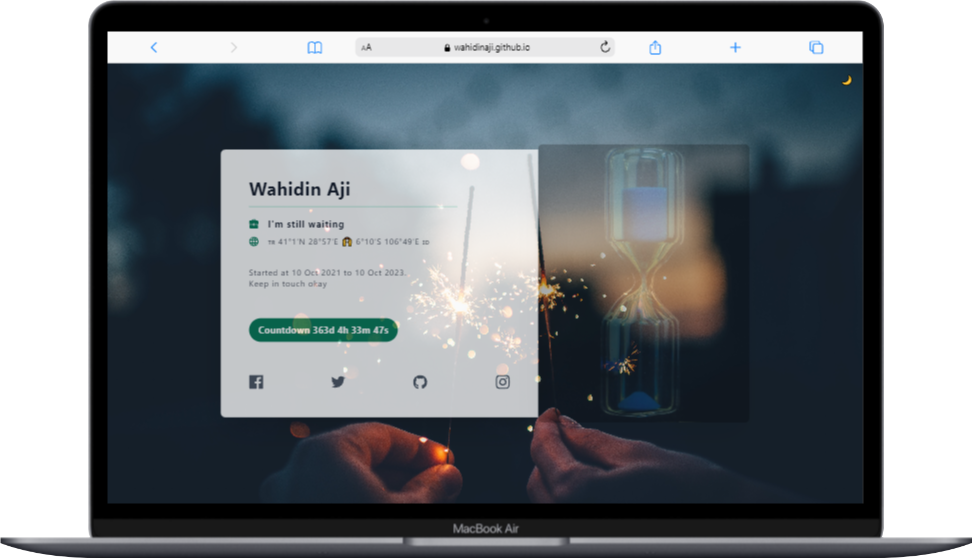
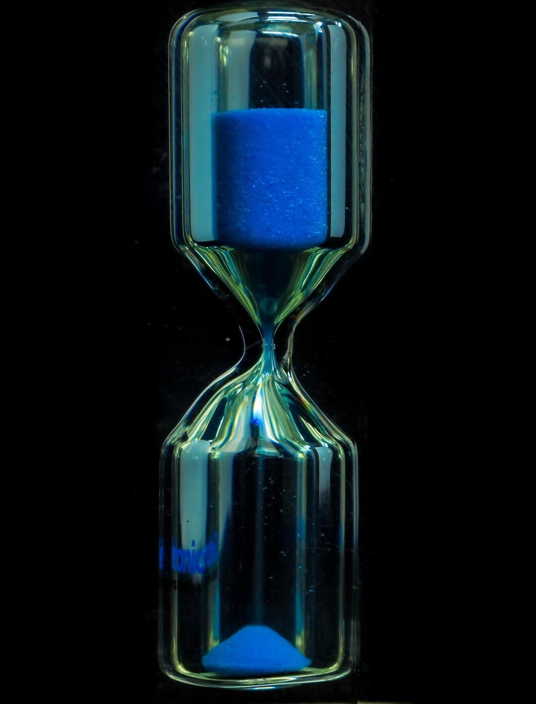

## Page
### Macbook Air

### Mobile

## Image References
* background image

* Icon title image

* Splash image

# Credits
## Copyright and License
* <a href="https://getemoji.com">Get Emoji</a>
* <a href="https://www.tailwindtoolbox.com/templates/profile-card.png">Reference Page</a>
* <a href="https://unsplash.com">Reference Images</a>
* <a href="https://convert-my-image.com/ImageConverter">Convert Image</a>
 
Copyright 2018-2019 Astrava.Solutions Ltd. Code released under the MIT license.
